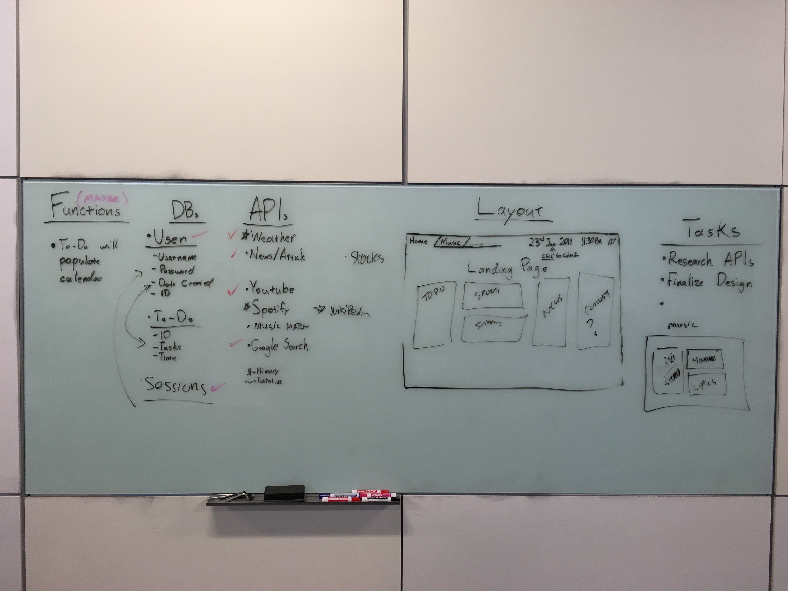

# Full-Stack-Project

<h2>Getting Started</h2>
    
 For this full-stack project, our team set a goal to develop a dashboard for users when they visit the web. The purpose of this dashboard was to provide the user with an aesthetic layout for an enjoyable user experience, and provide the functionality of a user to view the news, search for YouTube videos, create a to-do-list, view stock information, and be inspired with a unique quote on a day-to-day basis. The purpose of our dashboard is to centralize information that a user utilizes on a daily basis. This is an all-in-one location for a user to visit. 
    

 

<h2>Planning</h2>
    
    
 When we began planning out the features of what we would like to include in the dashboard, we listed out the requirements of the project. The key task at hand was to utilize an object-relational mapping (ORM) tool in conjunction with a database. This would allow us to store information for users. With that said, we began to sketch the features and tables that would be required to store the data. Since we were developing a landing page, we began to do research of what APIs we could implement. The purpose of this dashboard is to centralize information for a user.
    

    
<h2>Running Tests</h2>

<h2>Deployment</h2>

 
<h2>Built With: </h2>

    <ul>
        <li>HTML5 - develop structure of the website</li>
        <li>CSS - design</li>
        <li>Bootstrap4 - design and layout</li>
        <li>jQuery - dynamically developed objects, pulled user information, utilized for API calls</li>
        <li>Passport Authentication (Local Strategy) - to authenticate user and allow information to be stored for each other to develop a unique experience</li>
        <li>AWS (EC2 & RDS) - to host the website and create relational database that was accessible for the group to work on </li>
        <li>Node.js - used to setup the back-end structure of the website</li>
        <li>Express</li>
        <li>RESTful APIs - variety of APIs were utilized for our dashboard</li>
        <li>PostgreSQL</li>
        <li>Sequelize - ORM (object-relational mapping) to develop models and migrations </li>
        <li>Bash Scripting - used to log scripts for sequelize and capture node packages</li>
    </ul>

 
<h3> Node Packages Utilized (NPM Installs) </h3>
<ul>
    <li>passport</li>
    <li>passport-local</li>
    <li>cookie-parser</li>
    <li>body-parser</li>
    <li>express-session</li>
    <li>bcryptjs</li>
    <li>sequelize</li>
    <li>pg</li>
    <li>pg-hstore</li>
    <li>express</li>
    <li>ejs</li>
    <li>connect-session-sequelize</li>
</ul>

 

<h2>Authors</h2>
<li><a href="https://github.com/jeanjosephgeorge">Jean George</a></li>
<li><a href="https://github.com/acecoder93">Anuj Saheba</a></li>
<li><a href="https://github.com/stevenfisher22">Steven Fisher</a></li>
<li><a href="https://github.com/RMenjivar0204">Raul Menjivar</a></li>
